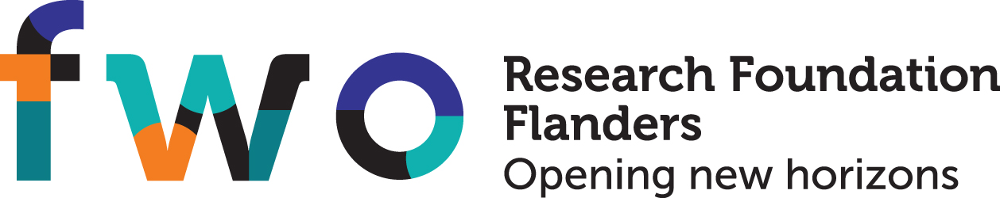

Acknowledgements
================

The research leading to these results has received funding from the European Research Council under the European Union's Seventh Framework Programme (FP7/2007-2013) / ERC Grant Agreement no. 615517, from the FWO (project no. G091017N, G0F9816N), and from the European Union's Horizon 2020 research and innovation programme and the FWO under the Marie Sklodowska-Curie Grant Agreement no. 665501.

.. image:: erc-logo.jpg
    :width: 420px
    :alt: ERC logo
    :align: center
    :target: https://erc.europa.eu/

