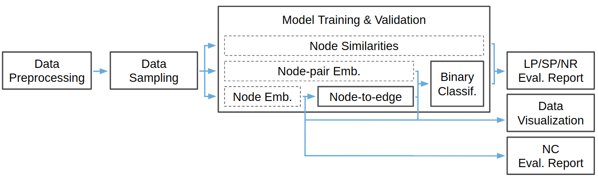

Features
========

EvalNE has been designed as a pipeline of interconnected and interchangeable building blocks. This structure provides the flexibility to create different evaluation pipelines and, thus, to evaluate methods from node embeddings, node-pair embeddings or similarity scores. The main building blocks that constitute EvalNE as well as the types of tasks and methods it can evaluate are presented in the following diagram. Blocks represented with solid lines correspond to modules provided by the library and those with dashed lines are the user-specified methods to be evaluated. 

.. note::

    For node classification (NC) tasks currently only nede embedding methods are supported.

.. note::

    The hyper-parameter tuning and evaluation setup functionalities are omitted in this diagram.

A more detailed description of the library features for the practitioner and for the methodologist are presented below. Further information can be found in our arXiv paper_.

.. _paper: https://arxiv.org/abs/1901.09691

For Methodologists
------------------

A command line interface in combination with a configuration file (describing datasets, 
methods and evaluation setup) allows the user
to evaluate any embedding method and compare 
it to the state of the art or replicate the experimental setup of existing papers without 
the need to write additional code. EvalNE does not provide implementations of any NE methods
but offers the necessary environment to evaluate any off-the-shelf algorithm. 
Implementations of NE methods can be obtained from libraries 
such as OpenNE_ or GEM_ as well as directly from the web pages of the authors e.g. 
Deepwalk_, Node2vec_, LINE_, PRUNE_, Metapath2vec_, CNE_. 

.. _OpenNE: https://github.com/thunlp/OpenNE
.. _GEM: https://github.com/palash1992/GEM
.. _Deepwalk: https://github.com/phanein/deepwalk
.. _Node2vec: https://github.com/aditya-grover/node2vec
.. _LINE: https://github.com/tangjianpku/LINE
.. _PRUNE: https://github.com/ntumslab/PRUNE
.. _Metapath2vec: https://ericdongyx.github.io/metapath2vec/m2v.html
.. _CNE: https://bitbucket.org/ghentdatascience/cne/

EvalNE also includes the following LP heuristics for both directed and
undirected networks (in and out node neighbourhoods), which can be used as
baselines:

- Random Prediction
- Common Neighbours
- Jaccard Coefficient
- Adamic Adar Index
- Preferential Attachment
- Resource Allocation Index
- Cosine Similarity
- Leicht-Holme-Newman index
- Topological Overlap
- Katz similarity
- All baselines (a combination of the first 5 heuristics in a 5-dim embedding)

For Practitioners
-----------------

When used as an API, EvalNE provides functions to:

- Load and preprocess graphs
- Obtain general graph statistics
- Conveniently read node/edge embeddings from files
- Sample nodes/edges to form train/test/validation sets
- Different approaches for edge sampling:

    - Timestamp based sampling: latest nodes are used for testing
    - Random sampling: random split of edges in train and test sets
    - Spanning tree sampling: train set will contain a spanning tree of the graph
    - Fast depth first search sampling: similar to spanning tree but based of DFS
    
- Negative sampling or generation of non-edge pairs using:

    - Open world assumption: train non-edges do not overlap with train edges
    - Closed world assumption: train non-edges do not overlap with either train nor test edges
    
- Evaluate LP, SP and NR for methods that output: 

    - Node Embeddings
    - Node-pair Embeddings
    - Similarity scores (e.g. the ones given by LP heuristics)
    
- Implements simple visualization routines for embeddings and graphs 
- Includes NC evaluation for node embedding methods
- Provides binary operators to compute edge embeddings from node feature vectors:

    - Average
    - Hadamard
    - Weighted L1
    - Weighted L2
    
- Can use any scikit-learn classifier for LP/SP/NR/NC tasks
- Provides routines to run command line commands or functions with a given timeout
- Includes hyperparameter tuning based on grid search
- Implements over 10 different evaluation metrics such as AUC, F-score, etc.
- AUC and PR curves can be provided as output
- Includes routines to generate tabular outputs and directly parse them to Latex tables

